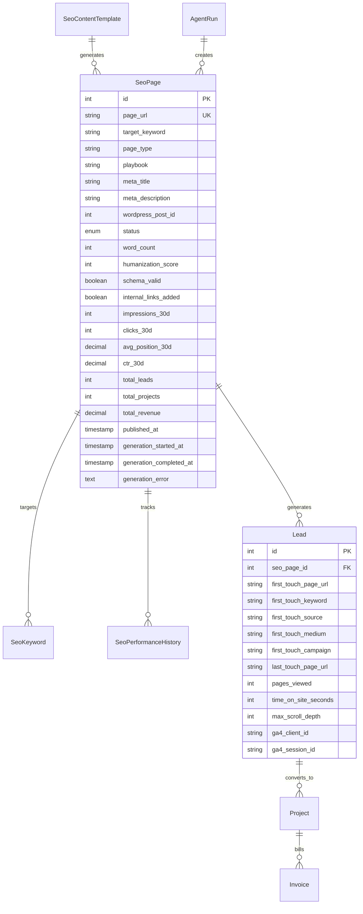

# Refactor Programmatic SEO System to World-Class

## Enhancement Summary

**Deepened on:** 2026-01-19
**Sections enhanced:** 6 phases + new additions
**Research agents used:** architecture-strategist, performance-oracle, security-sentinel, data-integrity-guardian, code-simplicity-reviewer, pattern-recognition-specialist, agent-native-reviewer, best-practices-researcher, framework-docs-researcher, programmatic-seo skill, schema-markup skill, analytics-tracking skill

### Key Improvements
1. **Security hardening** - SQL injection fix in SpinupWpSshService, authorization checks on all MCP tools
2. **Architecture improvements** - Event-driven status updates, idempotency checks, agent-native capabilities
3. **Expanded content strategy** - 185 pages instead of 100, adding Glossary, Examples, Curation, Tools playbooks
4. **Comprehensive analytics** - Full GTM data layer, scroll depth, time on page, form attribution

### New Considerations Discovered
- `page_type` enum values misaligned between Job and Service (HIGH priority fix)
- Missing agent capabilities: query pages, delete pages, check duplicates
- Schema markup should be dynamic by playbook type (Article vs Service vs FAQ)
- Need rate limiting for Google APIs to avoid quota exhaustion

---

## Overview

Transform Zao's programmatic SEO system from a promising prototype into a world-class content generation machine that can autonomously produce the best Laravel, WordPress, React Native, and app development content on the internet.

## Current State Assessment

### What's Working Well

The existing system has a **solid architectural foundation**:

| Component | Status | Notes |
|-----------|--------|-------|
| Multi-agent architecture | ✅ Good | Orchestrator-Worker pattern with ProgrammaticSeoAgent + SeoContentWriterAgent |
| 20 content playbooks | ✅ Good | Templates, Comparisons, Verticals, Case Studies, etc. |
| AI pattern detection | ✅ Good | Detects banned words, em dashes, hedging, chatbot artifacts |
| Quality gates method | ⚠️ Exists but unused | `passesQualityGates()` defined but never called |
| Attribution tracking schema | ✅ Good | SeoPage → Lead → Project → Revenue linkage designed |
| Google API integration | ✅ Good | Search Console + GA4 services implemented |
| WordPress publishing | ✅ Good | REST API integration via MCP tools |
| Admin UI | ✅ Good | Dashboard, Pages, Keywords Vue components |

### Critical Issues Identified

#### 🔴 Severity: HIGH (Must Fix)

| Issue | Location | Impact |
|-------|----------|--------|
| **SQL Injection in SSH Service** | `SpinupWpSshService.php` | Command injection via unsanitized domain parameter |
| **Quality gates never enforced** | `SeoResearchService.php:564-577` | Content published without quality validation |
| **SeoPage stuck in 'generating' forever** | `GenerateSeoContentJob.php:72` | No cleanup when agent fails |
| **Humanization not enforced** | `SeoContentWriterAgent.php:59` | Content may bypass 100/100 requirement |
| **Agent can't update SeoPage** | Missing tool | No `update-seo-page` tool for agent to set `wordpress_post_id` |
| **Lead attribution not implemented** | Missing implementation | `first_touch_page_url` fields exist but never populated |
| **Performance sync job missing** | `SyncSeoPerformanceJob` | Job referenced but not scheduled, metrics never sync |
| **page_type values misaligned** | Job vs Service | Job maps to 'template', service queries 'service_page' |

#### 🟡 Severity: MEDIUM (Should Fix)

| Issue | Location | Impact |
|-------|----------|--------|
| **No sitemap generation** | Missing | Search engines don't discover new pages |
| **Schema markup not validated** | SKILL.md instruction only | No enforcement or validation of JSON-LD |
| **No internal linking automation** | Missing tool | Agent can't query existing pages to link to |
| **Missing env vars for GSC/GA4** | `.env.example` | Deployment uses hardcoded defaults |
| **Grok as single point of failure** | `SeoResearchService.php:150` | No fallback LLM if Grok unavailable |
| **No duplicate content check** | Missing | Can create pages targeting same keyword |
| **Word count not tracked** | Missing DB column | Can't query for thin content |
| **Missing authorization on MCP tools** | All agent tools | Any authenticated user can trigger updates |

#### 🟢 Severity: LOW (Nice to Have)

| Issue | Location | Impact |
|-------|----------|--------|
| **30s HTTP timeout too short** | `WordPressMcpService.php:17` | Large pages may timeout |
| **Hardcoded Grok model** | `GrokService.php:26` | Config override ignored |
| **No content refresh workflow** | Missing | Create-only, no update path |

---

## Proposed Solution

A phased approach to systematically fix all issues and add capabilities needed to become the best tech agency SEO content on the internet.

---

## Phase 1: Foundation Fixes (Critical Path)

**Goal:** Make the existing system actually work reliably.

### Research Insights

**Architecture Best Practices:**
- Use event-driven architecture for status updates (emit `SeoPageGenerated` event when agent completes)
- Add idempotency checks to prevent duplicate page creation
- Implement circuit breaker pattern for external API calls (Google, WordPress, Grok)

**Security Requirements (CRITICAL):**
- Fix SQL injection in `SpinupWpSshService` - use `escapeshellarg()` on all user inputs
- Add authorization checks to all MCP tools via policies
- Validate and sanitize all agent inputs

**Data Integrity:**
- Use PHP enums for `status` and `page_type` columns
- Wrap related database operations in transactions
- Add database indexes for query performance

### 1.1 Fix SQL Injection Vulnerability (CRITICAL)

**Problem:** `SpinupWpSshService` passes unsanitized domain to shell commands.

**Solution:** Sanitize all inputs to shell commands.

```php
// In SpinupWpSshService.php - fix all shell commands
$safeDomain = escapeshellarg($domain);
$command = "wp-cli --path=/var/www/{$safeDomain}/public ...";
```

### 1.2 Fix Agent-to-Database Communication

**Problem:** SeoContentWriterAgent cannot update SeoPage records after creating WordPress pages.

**Solution:** Create `UpdateSeoPageTool` MCP tool with authorization.

### app/Agents/Tools/UpdateSeoPageTool.php

```php
<?php

namespace App\Agents\Tools;

use App\Models\SeoPage;
use Illuminate\Contracts\Auth\Authenticatable;
use Illuminate\Support\Facades\Gate;
use Laravel\Mcp\Facades\Tool;

class UpdateSeoPageTool extends Tool
{
    public function name(): string
    {
        return 'update-seo-page';
    }

    public function description(): string
    {
        return 'Update an SEO page record after content generation (set wordpress_post_id, status, etc.)';
    }

    public function parameters(): array
    {
        return [
            'page_id' => [
                'type' => 'integer',
                'description' => 'The SeoPage ID to update',
                'required' => true,
            ],
            'wordpress_post_id' => [
                'type' => 'integer',
                'description' => 'WordPress post/page ID after creation',
            ],
            'status' => [
                'type' => 'string',
                'enum' => ['generating', 'draft', 'review', 'active', 'archived', 'failed'],
                'description' => 'New status for the page',
            ],
            'humanization_score' => [
                'type' => 'integer',
                'description' => 'Score from humanization check (0-100)',
            ],
            'word_count' => [
                'type' => 'integer',
                'description' => 'Word count of generated content',
            ],
        ];
    }

    public function run(array $input, ?Authenticatable $user = null): array
    {
        // Authorization check
        if (!$user || !Gate::forUser($user)->allows('manage-seo')) {
            return ['error' => 'Unauthorized: requires manage-seo permission'];
        }

        $page = SeoPage::find($input['page_id']);

        if (!$page) {
            return ['error' => "SeoPage {$input['page_id']} not found"];
        }

        // Idempotency check - don't overwrite if already set
        if ($page->wordpress_post_id && isset($input['wordpress_post_id'])) {
            return [
                'error' => 'WordPress post ID already set',
                'existing_post_id' => $page->wordpress_post_id,
            ];
        }

        $updateData = array_filter([
            'wordpress_post_id' => $input['wordpress_post_id'] ?? null,
            'status' => $input['status'] ?? null,
            'humanization_score' => $input['humanization_score'] ?? null,
            'word_count' => $input['word_count'] ?? null,
            'generation_completed_at' => isset($input['status']) && $input['status'] !== 'generating'
                ? now()
                : null,
        ], fn($v) => $v !== null);

        $page->update($updateData);

        // Emit event for other listeners
        event(new \App\Events\SeoPageUpdated($page));

        return [
            'success' => true,
            'page' => $page->fresh()->toArray(),
        ];
    }
}
```

### 1.3 Add Additional Agent-Native Tools

**Problem:** Agent lacks capabilities to query existing pages, check for duplicates, and delete failed pages.

**Solution:** Add three more MCP tools for complete agent autonomy.

### app/Agents/Tools/SeoCheckDuplicateTool.php

```php
<?php

namespace App\Agents\Tools;

use App\Models\SeoPage;
use Laravel\Mcp\Facades\Tool;

class SeoCheckDuplicateTool extends Tool
{
    public function name(): string
    {
        return 'seo-check-duplicate';
    }

    public function description(): string
    {
        return 'Check if a page with this keyword or URL already exists';
    }

    public function parameters(): array
    {
        return [
            'target_keyword' => [
                'type' => 'string',
                'description' => 'Keyword to check for duplicates',
            ],
            'page_url' => [
                'type' => 'string',
                'description' => 'URL slug to check for duplicates',
            ],
        ];
    }

    public function run(array $input, ?Authenticatable $user = null): array
    {
        $duplicates = [];

        if (!empty($input['target_keyword'])) {
            $byKeyword = SeoPage::where('target_keyword', $input['target_keyword'])->first();
            if ($byKeyword) {
                $duplicates[] = [
                    'type' => 'keyword',
                    'page_id' => $byKeyword->id,
                    'status' => $byKeyword->status,
                    'url' => $byKeyword->page_url,
                ];
            }
        }

        if (!empty($input['page_url'])) {
            $byUrl = SeoPage::where('page_url', 'like', '%' . $input['page_url'] . '%')->first();
            if ($byUrl) {
                $duplicates[] = [
                    'type' => 'url',
                    'page_id' => $byUrl->id,
                    'status' => $byUrl->status,
                    'url' => $byUrl->page_url,
                ];
            }
        }

        return [
            'has_duplicates' => !empty($duplicates),
            'duplicates' => $duplicates,
        ];
    }
}
```

### 1.4 Add Missing Database Columns & Enums

**Migration:** Add tracking columns with proper types.

```php
// database/migrations/2026_01_19_add_quality_tracking_to_seo_pages.php

use Illuminate\Database\Migrations\Migration;
use Illuminate\Database\Schema\Blueprint;
use Illuminate\Support\Facades\Schema;

return new class extends Migration
{
    public function up(): void
    {
        Schema::table('seo_pages', function (Blueprint $table) {
            $table->integer('word_count')->nullable()->after('meta_description');
            $table->integer('humanization_score')->nullable()->after('word_count');
            $table->boolean('schema_valid')->default(false)->after('humanization_score');
            $table->boolean('internal_links_added')->default(false)->after('schema_valid');
            $table->timestamp('generation_started_at')->nullable()->after('published_at');
            $table->timestamp('generation_completed_at')->nullable()->after('generation_started_at');
            $table->text('generation_error')->nullable()->after('generation_completed_at');

            // Indexes for common queries
            $table->index(['status', 'generation_started_at']);
            $table->index(['published_at', 'impressions_30d']);
            $table->index('target_keyword');
        });
    }

    public function down(): void
    {
        Schema::table('seo_pages', function (Blueprint $table) {
            $table->dropColumn([
                'word_count', 'humanization_score', 'schema_valid',
                'internal_links_added', 'generation_started_at',
                'generation_completed_at', 'generation_error'
            ]);
        });
    }
};
```

### app/Enums/SeoPageStatus.php

```php
<?php

namespace App\Enums;

enum SeoPageStatus: string
{
    case Pending = 'pending';
    case Generating = 'generating';
    case Draft = 'draft';
    case Review = 'review';
    case Active = 'active';
    case Archived = 'archived';
    case Failed = 'failed';

    public function isTerminal(): bool
    {
        return in_array($this, [self::Active, self::Archived, self::Failed]);
    }

    public function canTransitionTo(self $new): bool
    {
        return match($this) {
            self::Pending => in_array($new, [self::Generating, self::Failed]),
            self::Generating => in_array($new, [self::Draft, self::Failed]),
            self::Draft => in_array($new, [self::Review, self::Active, self::Failed]),
            self::Review => in_array($new, [self::Active, self::Draft, self::Failed]),
            self::Active => in_array($new, [self::Archived]),
            self::Archived, self::Failed => false,
        };
    }
}
```

### 1.5 Implement Status Cleanup Job (Simplified)

**Problem:** Pages stuck in 'generating' status forever when agents fail.

### app/Jobs/CleanupStaleSeoGenerationsJob.php

```php
<?php

namespace App\Jobs;

use App\Enums\SeoPageStatus;
use App\Models\SeoPage;
use Illuminate\Contracts\Queue\ShouldQueue;
use Illuminate\Foundation\Queue\Queueable;

class CleanupStaleSeoGenerationsJob implements ShouldQueue
{
    use Queueable;

    public function handle(): void
    {
        $threshold = now()->subMinutes(30);

        $updated = SeoPage::where('status', SeoPageStatus::Generating)
            ->where('generation_started_at', '<', $threshold)
            ->update([
                'status' => SeoPageStatus::Failed,
                'generation_error' => 'Generation timed out after 30 minutes',
                'generation_completed_at' => now(),
            ]);

        if ($updated > 0) {
            logger()->warning("Cleaned up {$updated} stale SEO page generations");
        }
    }
}
```

**Schedule in `routes/console.php`:**

```php
use App\Jobs\CleanupStaleSeoGenerationsJob;

Schedule::job(new CleanupStaleSeoGenerationsJob)
    ->everyFiveMinutes()
    ->name('seo:cleanup-stale-generations')
    ->withoutOverlapping();
```

### 1.6 Add Missing Environment Variables

**Add to `.env.example`:**

```bash
# Programmatic SEO - Google Integration
GOOGLE_SEARCH_CONSOLE_SITE_URL=sc-domain:example.com
GOOGLE_GA4_PROPERTY_ID=

# Programmatic SEO - Content Generation
GROK_API_KEY=
GROK_MODEL=grok-4-1-fast

# Rate Limiting for Google APIs
GOOGLE_API_RATE_LIMIT_PER_MINUTE=60

# Optional - Enhanced keyword data
SEMRUSH_API_KEY=
AHREFS_API_KEY=
```

**Add to `config/services.php`:**

```php
'google' => [
    // ... existing
    'search_console_site_url' => env('GOOGLE_SEARCH_CONSOLE_SITE_URL'),
    'ga4_property_id' => env('GOOGLE_GA4_PROPERTY_ID'),
    'api_rate_limit' => env('GOOGLE_API_RATE_LIMIT_PER_MINUTE', 60),
],
```

---

## Phase 2: Content Quality Enforcement

**Goal:** Ensure every page meets quality standards before reaching WordPress.

### Research Insights

**Schema Markup by Playbook:**
- Service pages → `Service` + `Organization` schema
- Comparison pages → `ItemList` + `Product` schemas for each item
- Location pages → `LocalBusiness` + `Service` + `GeoCoordinates`
- Case Study pages → `Article` + `Organization` + `CreativeWork`
- FAQ/Glossary pages → `FAQPage` schema
- Integration pages → `SoftwareApplication` + `Service`

**Playbook-Specific Validation:**
- Each playbook has different minimum word counts and required sections
- Comparison pages must have comparison table
- Location pages must include address/geo data
- Case studies must include metrics

### 2.1 Create Schema Generator Service

### app/Services/Seo/SchemaGeneratorService.php

```php
<?php

namespace App\Services\Seo;

use App\Models\SeoPage;

class SchemaGeneratorService
{
    public function generateForPage(SeoPage $page): array
    {
        $baseSchema = $this->getOrganizationSchema();
        $pageSchema = $this->getSchemaForPlaybook($page);

        return [
            '@context' => 'https://schema.org',
            '@graph' => array_filter([$baseSchema, $pageSchema]),
        ];
    }

    private function getSchemaForPlaybook(SeoPage $page): ?array
    {
        return match($page->playbook) {
            'Comparisons' => $this->comparisonSchema($page),
            'Location' => $this->localBusinessSchema($page),
            'Case Study' => $this->articleSchema($page),
            'Glossary', 'Educational' => $this->faqSchema($page),
            'Vertical', 'Persona' => $this->serviceSchema($page),
            'Integrations' => $this->softwareSchema($page),
            default => $this->serviceSchema($page),
        };
    }

    private function comparisonSchema(SeoPage $page): array
    {
        return [
            '@type' => 'ItemList',
            'name' => $page->meta_title,
            'description' => $page->meta_description,
            'numberOfItems' => 2,
            'itemListElement' => [
                ['@type' => 'ListItem', 'position' => 1, 'name' => 'Option A'],
                ['@type' => 'ListItem', 'position' => 2, 'name' => 'Option B'],
            ],
        ];
    }

    private function localBusinessSchema(SeoPage $page): array
    {
        return [
            '@type' => 'ProfessionalService',
            'name' => 'Zao - ' . $page->target_keyword,
            'description' => $page->meta_description,
            'url' => $page->page_url,
            'address' => [
                '@type' => 'PostalAddress',
                'addressLocality' => 'Portland',
                'addressRegion' => 'OR',
                'addressCountry' => 'US',
            ],
            'geo' => [
                '@type' => 'GeoCoordinates',
                'latitude' => '45.5155',
                'longitude' => '-122.6789',
            ],
            'areaServed' => $this->extractLocation($page->target_keyword),
            'serviceType' => $this->extractService($page->target_keyword),
        ];
    }

    private function serviceSchema(SeoPage $page): array
    {
        return [
            '@type' => 'Service',
            'name' => $page->meta_title,
            'description' => $page->meta_description,
            'provider' => ['@id' => 'https://example.com/#organization'],
            'serviceType' => $this->extractService($page->target_keyword),
        ];
    }

    private function articleSchema(SeoPage $page): array
    {
        return [
            '@type' => 'Article',
            'headline' => $page->meta_title,
            'description' => $page->meta_description,
            'author' => ['@id' => 'https://example.com/#organization'],
            'publisher' => ['@id' => 'https://example.com/#organization'],
            'datePublished' => $page->published_at?->toIso8601String(),
            'dateModified' => $page->updated_at->toIso8601String(),
        ];
    }

    private function faqSchema(SeoPage $page): array
    {
        return [
            '@type' => 'FAQPage',
            'name' => $page->meta_title,
            'description' => $page->meta_description,
            'mainEntity' => [], // Populated by content extractor
        ];
    }

    private function softwareSchema(SeoPage $page): array
    {
        return [
            '@type' => 'SoftwareApplication',
            'name' => $page->meta_title,
            'description' => $page->meta_description,
            'applicationCategory' => 'WebApplication',
            'operatingSystem' => 'Web',
        ];
    }

    private function getOrganizationSchema(): array
    {
        return [
            '@type' => 'Organization',
            '@id' => 'https://example.com/#organization',
            'name' => 'Zao',
            'url' => 'https://example.com',
            'logo' => 'https://example.com/images/zao-logo.png',
            'sameAs' => [
                'https://github.com/example',
                'https://linkedin.com/company/zao',
                'https://twitter.com/zaoinc',
            ],
        ];
    }

    private function extractLocation(string $keyword): string
    {
        // Extract city/state from keywords like "Laravel Agency Portland"
        $locations = ['Portland', 'Seattle', 'Denver', 'Austin', 'San Francisco'];
        foreach ($locations as $loc) {
            if (stripos($keyword, $loc) !== false) {
                return $loc;
            }
        }
        return 'United States';
    }

    private function extractService(string $keyword): string
    {
        if (stripos($keyword, 'Laravel') !== false) return 'Laravel Development';
        if (stripos($keyword, 'WordPress') !== false) return 'WordPress Development';
        if (stripos($keyword, 'React Native') !== false) return 'React Native Development';
        return 'Custom Software Development';
    }
}
```

### 2.2 Enhanced Content Validator Service

### app/Services/Seo/ContentValidatorService.php

```php
<?php

namespace App\Services\Seo;

class ContentValidatorService
{
    public function __construct(
        private SeoResearchService $research,
        private SchemaGeneratorService $schemaGenerator,
    ) {}

    public function validate(array $content, string $playbook): array
    {
        $errors = [];
        $warnings = [];

        // Word count by playbook
        $minWords = $this->getMinWordCount($playbook);
        $wordCount = str_word_count(strip_tags($content['content'] ?? ''));

        if ($wordCount < $minWords) {
            $errors[] = "Content too short: {$wordCount} words (minimum: {$minWords})";
        }

        // Humanization check
        $patterns = $this->research->detectAIPatterns($content['content'] ?? '');
        if (!empty($patterns)) {
            $errors[] = "AI patterns detected: " . implode(', ', array_slice($patterns, 0, 3));
        }

        // Meta length checks
        $titleLen = strlen($content['meta_title'] ?? '');
        $descLen = strlen($content['meta_description'] ?? '');

        if ($titleLen > 60) {
            $warnings[] = "Meta title {$titleLen} chars (max 60)";
        }
        if ($descLen > 160) {
            $warnings[] = "Meta description {$descLen} chars (max 160)";
        }

        // Playbook-specific validation
        $playbookErrors = $this->validatePlaybookRequirements($content, $playbook);
        $errors = array_merge($errors, $playbookErrors);

        // Schema markup check
        if (!$this->hasValidSchema($content['content'] ?? '')) {
            $warnings[] = "No valid schema markup detected";
        }

        // Internal links check
        $internalLinks = $this->countInternalLinks($content['content'] ?? '');
        if ($internalLinks < 3) {
            $warnings[] = "Only {$internalLinks} internal links (recommend 3-5)";
        }

        $humanizationScore = empty($patterns) ? 100 : max(0, 100 - (count($patterns) * 10));

        return [
            'valid' => empty($errors),
            'score' => $this->calculateScore($errors, $warnings),
            'errors' => $errors,
            'warnings' => $warnings,
            'metadata' => [
                'word_count' => $wordCount,
                'internal_links' => $internalLinks,
                'humanization_score' => $humanizationScore,
            ],
        ];
    }

    private function validatePlaybookRequirements(array $content, string $playbook): array
    {
        $errors = [];
        $body = $content['content'] ?? '';

        return match($playbook) {
            'Comparisons' => $this->validateComparison($body),
            'Location' => $this->validateLocation($body),
            'Case Study' => $this->validateCaseStudy($body),
            'Glossary' => $this->validateGlossary($body),
            default => [],
        };
    }

    private function validateComparison(string $body): array
    {
        $errors = [];
        if (!str_contains($body, '<table') && !str_contains($body, 'comparison')) {
            $errors[] = "Comparison pages should include a comparison table";
        }
        if (!preg_match('/vs\.?|versus|compared to/i', $body)) {
            $errors[] = "Comparison pages should explicitly compare options";
        }
        return $errors;
    }

    private function validateLocation(string $body): array
    {
        $errors = [];
        $locations = ['Portland', 'Seattle', 'Denver', 'Austin', 'San Francisco', 'Oregon', 'Washington'];
        $hasLocation = false;
        foreach ($locations as $loc) {
            if (stripos($body, $loc) !== false) {
                $hasLocation = true;
                break;
            }
        }
        if (!$hasLocation) {
            $errors[] = "Location pages must reference specific geographic area";
        }
        return $errors;
    }

    private function validateCaseStudy(string $body): array
    {
        $errors = [];
        if (!preg_match('/\d+%|\d+x|increased|decreased|improved/i', $body)) {
            $errors[] = "Case studies should include measurable results";
        }
        return $errors;
    }

    private function validateGlossary(string $body): array
    {
        $errors = [];
        if (!preg_match('/<h[23]|definition|meaning|what is/i', $body)) {
            $errors[] = "Glossary pages should have clear definition structure";
        }
        return $errors;
    }

    private function getMinWordCount(string $playbook): int
    {
        return match($playbook) {
            'Location' => 1000,
            'Persona', 'Vertical' => 1200,
            'Comparisons' => 1500,
            'Case Study' => 1000,
            'Glossary', 'Educational' => 600,
            'Templates', 'Tools', 'Calculators', 'Converters' => 800,
            'Examples', 'Curation' => 1000,
            default => 800,
        };
    }

    private function hasValidSchema(string $content): bool
    {
        return str_contains($content, 'application/ld+json');
    }

    private function countInternalLinks(string $content): int
    {
        preg_match_all('/href=["\']https?:\/\/zao\.is[^"\']*["\']/i', $content, $matches);
        return count($matches[0]);
    }

    private function calculateScore(array $errors, array $warnings): int
    {
        $score = 100;
        $score -= count($errors) * 20;
        $score -= count($warnings) * 5;
        return max(0, $score);
    }
}
```

### 2.3 Add Internal Link Discovery Tool

### app/Agents/Tools/SeoGetExistingPagesTool.php

```php
<?php

namespace App\Agents\Tools;

use App\Models\SeoPage;
use Illuminate\Contracts\Auth\Authenticatable;
use Laravel\Mcp\Facades\Tool;

class SeoGetExistingPagesTool extends Tool
{
    public function name(): string
    {
        return 'seo-get-existing-pages';
    }

    public function description(): string
    {
        return 'Get list of existing SEO pages for internal linking. Returns URLs and keywords of published pages.';
    }

    public function parameters(): array
    {
        return [
            'page_type' => [
                'type' => 'string',
                'description' => 'Filter by page type (service, comparison, guide, etc.)',
            ],
            'technology' => [
                'type' => 'string',
                'description' => 'Filter by technology (laravel, wordpress, react-native)',
            ],
            'exclude_page_id' => [
                'type' => 'integer',
                'description' => 'Exclude this page from results (current page being generated)',
            ],
            'limit' => [
                'type' => 'integer',
                'description' => 'Maximum pages to return (default: 20)',
            ],
        ];
    }

    public function run(array $input, ?Authenticatable $user = null): array
    {
        $query = SeoPage::where('status', 'active');

        if (!empty($input['page_type'])) {
            $query->where('page_type', $input['page_type']);
        }

        if (!empty($input['technology'])) {
            $query->where(function ($q) use ($input) {
                $q->where('target_keyword', 'like', "%{$input['technology']}%")
                  ->orWhere('page_url', 'like', "%{$input['technology']}%");
            });
        }

        if (!empty($input['exclude_page_id'])) {
            $query->where('id', '!=', $input['exclude_page_id']);
        }

        $pages = $query->limit($input['limit'] ?? 20)
            ->orderBy('impressions_30d', 'desc') // Prioritize high-performing pages
            ->select(['id', 'page_url', 'target_keyword', 'meta_title', 'page_type'])
            ->get();

        return [
            'pages' => $pages->map(fn($p) => [
                'url' => $p->page_url,
                'keyword' => $p->target_keyword,
                'title' => $p->meta_title,
                'type' => $p->page_type,
                'anchor_suggestion' => $p->target_keyword,
            ])->toArray(),
            'count' => $pages->count(),
        ];
    }
}
```

---

## Phase 3: Lead Attribution & Comprehensive Analytics

**Goal:** Track which SEO pages generate leads and revenue with full-funnel visibility.

### Research Insights

**Analytics Tracking Best Practices:**
- Use GTM data layer for all custom events
- Track scroll depth (25%, 50%, 75%, 100%)
- Track time on page with engagement thresholds
- Capture UTM parameters and persist across session
- Use GA4 client_id for cross-device attribution
- Implement Enhanced Measurement events

**Event Naming Convention:**
- Format: `object_action` (e.g., `form_submitted`, `cta_clicked`)
- Lowercase with underscores
- Include context in properties, not event name

### 3.1 Enhanced Attribution Migration

```php
// database/migrations/2026_01_19_add_enhanced_attribution_to_leads.php

Schema::table('leads', function (Blueprint $table) {
    // First touch attribution
    $table->string('first_touch_page_url', 500)->nullable();
    $table->string('first_touch_keyword', 255)->nullable();
    $table->string('first_touch_source')->nullable();
    $table->string('first_touch_medium')->nullable();
    $table->string('first_touch_campaign')->nullable();

    // Last touch attribution
    $table->string('last_touch_page_url', 500)->nullable();

    // Engagement metrics
    $table->integer('pages_viewed')->nullable();
    $table->integer('time_on_site_seconds')->nullable();
    $table->integer('max_scroll_depth')->nullable();

    // GA4 linkage
    $table->string('ga4_client_id', 100)->nullable();
    $table->string('ga4_session_id', 100)->nullable();

    // SEO page linkage
    $table->foreignId('seo_page_id')->nullable()->constrained('seo_pages');

    $table->index('first_touch_page_url');
    $table->index('ga4_client_id');
});
```

### 3.2 GTM Data Layer Implementation

**Add to WordPress theme or main site layout:**

```html
<!-- GTM Data Layer -->
<script>
window.dataLayer = window.dataLayer || [];

// Initialize tracking state
const trackingState = {
    firstTouch: JSON.parse(sessionStorage.getItem('zao_first_touch') || 'null'),
    pagesViewed: parseInt(sessionStorage.getItem('zao_pages_viewed') || '0') + 1,
    sessionStart: parseInt(sessionStorage.getItem('zao_session_start') || Date.now()),
    maxScrollDepth: 0,
};

// Set first touch if not exists
if (!trackingState.firstTouch) {
    trackingState.firstTouch = {
        url: window.location.href,
        keyword: new URLSearchParams(window.location.search).get('keyword') || '',
        source: new URLSearchParams(window.location.search).get('utm_source') || document.referrer || 'direct',
        medium: new URLSearchParams(window.location.search).get('utm_medium') || 'organic',
        campaign: new URLSearchParams(window.location.search).get('utm_campaign') || '',
        timestamp: Date.now(),
    };
    sessionStorage.setItem('zao_first_touch', JSON.stringify(trackingState.firstTouch));
}

// Update session storage
sessionStorage.setItem('zao_pages_viewed', trackingState.pagesViewed.toString());
sessionStorage.setItem('zao_session_start', trackingState.sessionStart.toString());

// Push initial page view with enhanced data
dataLayer.push({
    event: 'page_view_enhanced',
    page_type: '{{ page_type }}', // Injected by PHP
    is_seo_page: {{ is_seo_page ? 'true' : 'false' }},
    target_keyword: '{{ target_keyword }}',
    pages_in_session: trackingState.pagesViewed,
    time_in_session: Math.floor((Date.now() - trackingState.sessionStart) / 1000),
    first_touch_source: trackingState.firstTouch.source,
    first_touch_medium: trackingState.firstTouch.medium,
});

// Scroll depth tracking
let scrollDepthMarkers = [25, 50, 75, 100];
let firedMarkers = [];

function getScrollDepth() {
    const scrollTop = window.pageYOffset || document.documentElement.scrollTop;
    const docHeight = document.documentElement.scrollHeight - window.innerHeight;
    return Math.round((scrollTop / docHeight) * 100);
}

window.addEventListener('scroll', function() {
    const depth = getScrollDepth();
    trackingState.maxScrollDepth = Math.max(trackingState.maxScrollDepth, depth);

    scrollDepthMarkers.forEach(marker => {
        if (depth >= marker && !firedMarkers.includes(marker)) {
            firedMarkers.push(marker);
            dataLayer.push({
                event: 'scroll_depth',
                scroll_depth: marker,
                page_type: '{{ page_type }}',
            });
        }
    });
});

// Time on page tracking
let timeMarkers = [30, 60, 120, 300]; // seconds
let firedTimeMarkers = [];

setInterval(function() {
    const timeOnPage = Math.floor((Date.now() - performance.timing.navigationStart) / 1000);

    timeMarkers.forEach(marker => {
        if (timeOnPage >= marker && !firedTimeMarkers.includes(marker)) {
            firedTimeMarkers.push(marker);
            dataLayer.push({
                event: 'time_on_page',
                seconds: marker,
                page_type: '{{ page_type }}',
            });
        }
    });
}, 5000);

// Expose for form submission
window.zaoTracking = {
    getAttributionData: function() {
        return {
            first_touch_page_url: trackingState.firstTouch?.url || '',
            first_touch_keyword: trackingState.firstTouch?.keyword || '',
            first_touch_source: trackingState.firstTouch?.source || '',
            first_touch_medium: trackingState.firstTouch?.medium || '',
            first_touch_campaign: trackingState.firstTouch?.campaign || '',
            last_touch_page_url: window.location.href,
            pages_viewed: trackingState.pagesViewed,
            time_on_site_seconds: Math.floor((Date.now() - trackingState.sessionStart) / 1000),
            max_scroll_depth: trackingState.maxScrollDepth,
        };
    }
};
</script>
```

### 3.3 Form Attribution Integration

**Gravity Forms webhook handler:**

```php
// In LeadController or Gravity Forms handler

public function handleFormSubmission(Request $request): JsonResponse
{
    $attribution = $request->only([
        'first_touch_page_url',
        'first_touch_keyword',
        'first_touch_source',
        'first_touch_medium',
        'first_touch_campaign',
        'last_touch_page_url',
        'pages_viewed',
        'time_on_site_seconds',
        'max_scroll_depth',
        'ga4_client_id',
    ]);

    $lead = Lead::create([
        // ... form fields
        ...$attribution,
    ]);

    // Link to SEO page if applicable
    if ($attribution['first_touch_page_url']) {
        $seoPage = SeoPage::where('page_url', $attribution['first_touch_page_url'])->first();
        if ($seoPage) {
            $lead->update(['seo_page_id' => $seoPage->id]);
            $seoPage->increment('total_leads');

            // Track in GA4
            event(new LeadAttributedToSeoPage($lead, $seoPage));
        }
    }

    return response()->json(['success' => true, 'lead_id' => $lead->id]);
}
```

---

## Phase 4: Performance Syncing

**Goal:** Automatically sync Search Console and GA4 data daily.

### Research Insights

**Rate Limiting:**
- Google Search Console API: 1200 queries/min for property queries
- GA4 Data API: 10 requests/second per property
- Implement exponential backoff for retries
- Cache API responses for 24 hours

### 4.1 Schedule Performance Sync with Rate Limiting

**Add to `routes/console.php`:**

```php
use App\Jobs\SyncSeoPerformanceJob;

// Sync SEO performance data daily at 5:30 AM
Schedule::job(new SyncSeoPerformanceJob)
    ->dailyAt('05:30')
    ->name('seo:sync-performance')
    ->withoutOverlapping()
    ->onOneServer();
```

### 4.2 Rate-Limited Sync Job

```php
// In SyncSeoPerformanceJob::handle()

use Illuminate\Support\Facades\RateLimiter;

public function handle(): void
{
    $rateLimit = config('services.google.api_rate_limit', 60);

    SeoPage::where('status', 'active')
        ->whereNotNull('page_url')
        ->chunk(50, function ($pages) use ($rateLimit) {
            foreach ($pages as $page) {
                // Rate limit API calls
                RateLimiter::attempt(
                    'google-api',
                    $rateLimit,
                    fn() => $this->syncPage($page),
                    60 // decay in seconds
                );

                // Small delay between pages
                usleep(100000); // 100ms
            }
        });
}

private function syncPage(SeoPage $page): void
{
    try {
        $metrics = $this->searchConsoleService->getPageMetrics($page->page_url);

        $page->update([
            'impressions_30d' => $metrics['impressions'] ?? 0,
            'clicks_30d' => $metrics['clicks'] ?? 0,
            'avg_position_30d' => $metrics['position'] ?? null,
            'ctr_30d' => $metrics['ctr'] ?? null,
        ]);

        // Store historical record
        SeoPerformanceHistory::create([
            'seo_page_id' => $page->id,
            'date' => now()->toDateString(),
            'impressions' => $metrics['impressions'] ?? 0,
            'clicks' => $metrics['clicks'] ?? 0,
            'position' => $metrics['position'] ?? null,
        ]);
    } catch (\Exception $e) {
        logger()->warning("Failed to sync SEO metrics for page {$page->id}", [
            'error' => $e->getMessage(),
        ]);
    }
}
```

---

## Phase 5: Content Strategy for Market Domination

**Goal:** Create the playbook execution strategy to become #1 for Laravel, WordPress, React Native content.

### Research Insights

**Additional Playbooks Identified:**
- **Glossary** (30 pages) - "What is Laravel", "What is Eloquent", etc.
- **Examples** (20 pages) - "Laravel SaaS Examples", "WordPress Nonprofit Examples"
- **Curation** (15 pages) - "Best Laravel Packages 2026", "Top WordPress Plugins for..."
- **Tools** (10 pages) - Free calculators, generators, audit tools

**Content Differentiation:**
- Every page MUST include proprietary Zao data
- Minimum 3 internal links per page
- Schema markup required and validated
- Humanization score must be 100/100

### 5.1 Expanded Priority Content Matrix (185 Pages Total)

| Priority | Playbook | Target Keywords | Est. Pages | Unique Value |
|----------|----------|-----------------|------------|--------------|
| 1 | Comparisons | "Laravel vs X", "WordPress vs X" | 30 | Decision frameworks, feature tables |
| 2 | Verticals | "Laravel for Healthcare", etc. | 25 | Industry expertise, compliance |
| 3 | Glossary | "What is Eloquent", "Laravel MVC" | 30 | Clear definitions, code examples |
| 4 | Examples | "Laravel E-commerce Examples" | 20 | Real screenshots, analysis |
| 5 | Case Studies | Actual client projects | 15 | Real metrics, testimonials |
| 6 | Integrations | "Laravel + Stripe", etc. | 20 | Setup guides, code samples |
| 7 | Curation | "Best Laravel Packages 2026" | 15 | Curated recommendations |
| 8 | Tools | Calculators, generators | 10 | Interactive utilities |
| 9 | Persona | "CTO Guide to Laravel" | 15 | Role-specific content |
| 10 | Location | "Laravel Agency Portland" | 5 | Local credibility |

**Total: 185 pages**

### 5.2 First 185 Pages Target List

**Comparison Pages (30):**
- Laravel vs Django (5 verticals: Healthcare, Fintech, SaaS, E-commerce, Startups)
- Laravel vs Node.js (API Development, Real-time Apps, Startups)
- Laravel vs Rails (Rapid Development, Startups, MVPs)
- WordPress vs Webflow (Corporate, Agency, E-commerce)
- WordPress vs Squarespace (Small Business, Portfolio, Blog)
- WooCommerce vs Shopify (Subscriptions, Custom, Enterprise)
- React Native vs Flutter (Healthcare, Finance, Consumer)
- Toptal vs Zao (Laravel, WordPress, React Native)

**Glossary Pages (30):**
- Laravel: Eloquent, Blade, Artisan, Middleware, Facades, Service Container, Queue, Events, Horizon, Sanctum
- WordPress: Hooks, Filters, Actions, Custom Post Types, Gutenberg, REST API, WP-CLI, Multisite
- React Native: Expo, Metro, Bridge, Native Modules, Hermes, Fabric
- General: MVC, API, REST, GraphQL, CI/CD, DevOps

**Examples Pages (20):**
- Laravel: SaaS Apps, E-commerce, Healthcare Portals, Real-time Apps, API Backends
- WordPress: Corporate Sites, Membership Sites, E-commerce, Multilingual, Nonprofit
- React Native: Fintech Apps, Healthcare Apps, E-commerce Apps, Social Apps

**Vertical Pages (25):**
- Laravel for: Healthcare, Fintech, SaaS, Real Estate, Education, Logistics, Legal, Insurance
- WordPress for: Healthcare, Nonprofits, Higher Education, Law Firms, Restaurants, Real Estate, Churches
- React Native for: Healthcare, Finance, Retail, Travel, Fitness

**Case Studies (15):**
- All actual client projects with permission and metrics

**Integration Pages (20):**
- Laravel + Stripe, Twilio, AWS, Salesforce, HubSpot, SendGrid, Pusher
- WordPress + Salesforce, HubSpot, Mailchimp, Zapier, GA4, Stripe
- React Native + Firebase, AWS Amplify, Stripe, OneSignal

**Curation Pages (15):**
- Best Laravel Packages 2026
- Best WordPress Themes for Agencies
- Best React Native Libraries
- Essential Laravel Tools
- WordPress Security Plugins Guide

**Tools Pages (10):**
- Laravel Project Cost Calculator
- WordPress Site Audit Tool
- React Native vs Flutter Comparison Tool
- Tech Stack Selector
- API Performance Calculator

**Persona Pages (15):**
- CTO's Guide to Laravel
- Startup Founder's Guide to MVP Development
- Non-Profit Director's Guide to WordPress
- Healthcare CIO's Guide to HIPAA Compliance
- Agency Owner's Guide to WordPress Maintenance

**Location Pages (5):**
- Portland, Seattle, Denver, Austin, San Francisco (combined technology focus)

### 5.3 Proprietary Data Requirements

Each page MUST include at least TWO of:

1. **Case study metrics** - "We reduced load time by 60% for Client X"
2. **Project count** - "Built 47 Laravel healthcare applications"
3. **Team expertise** - "3 developers with 10+ years Laravel experience"
4. **Client quotes** - Direct testimonials with permission
5. **Unique insights** - Lessons learned from actual projects
6. **Benchmark data** - Performance comparisons from real projects
7. **Cost/timeline data** - "Typical Laravel MVP: 8-12 weeks, $40-80K"

---

## Phase 6: Monitoring & Continuous Improvement

### 6.1 SEO Health Dashboard Metrics

Add to `SeoPerformanceService`:

```php
public function getSystemHealth(): array
{
    return [
        'pages_generating' => SeoPage::where('status', SeoPageStatus::Generating)->count(),
        'pages_stuck' => SeoPage::where('status', SeoPageStatus::Generating)
            ->where('generation_started_at', '<', now()->subHours(1))->count(),
        'pages_failed' => SeoPage::where('status', SeoPageStatus::Failed)
            ->where('created_at', '>', now()->subDays(7))->count(),
        'pages_no_traffic' => SeoPage::where('status', SeoPageStatus::Active)
            ->where('impressions_30d', 0)
            ->where('published_at', '<', now()->subDays(30))->count(),
        'avg_humanization_score' => SeoPage::whereNotNull('humanization_score')
            ->avg('humanization_score'),
        'pages_below_word_count' => SeoPage::where('word_count', '<', 800)->count(),
        'total_leads_from_seo' => Lead::whereNotNull('seo_page_id')->count(),
        'top_performing_pages' => SeoPage::where('status', SeoPageStatus::Active)
            ->orderBy('clicks_30d', 'desc')
            ->limit(5)
            ->get(['id', 'page_url', 'target_keyword', 'clicks_30d']),
    ];
}
```

### 6.2 Weekly Performance Email

```php
// Schedule weekly report
Schedule::call(function () {
    $kpis = app(SeoPerformanceService::class)->getDashboardKpis();
    $health = app(SeoPerformanceService::class)->getSystemHealth();

    Mail::to(config('seo.report_email'))
        ->send(new WeeklySeoPerformanceReport($kpis, $health));
})->weeklyOn(1, '9:00')->name('seo:weekly-report');
```

### 6.3 Alerting

```php
// Alert on stuck pages
Schedule::call(function () {
    $stuck = SeoPage::where('status', SeoPageStatus::Generating)
        ->where('generation_started_at', '<', now()->subHours(2))
        ->count();

    if ($stuck > 0) {
        Notification::route('slack', config('services.slack.alerts_webhook'))
            ->notify(new StuckSeoGenerationsAlert($stuck));
    }
})->hourly()->name('seo:alert-stuck-pages');
```

---

## Acceptance Criteria

### Phase 1 Complete When:
- [x] SQL injection fixed in `SpinupWpSshService`
- [x] `UpdateSeoPageTool` created with authorization and registered (as `SeoUpdatePageTool`)
- [x] `SeoCheckDuplicateTool` created and registered
- [x] `SeoPageStatus` enum created and applied
- [x] Migration run adding quality tracking columns with indexes
- [x] `CleanupStaleSeoGenerationsJob` scheduled every 30 minutes
- [x] Environment variables added to `.env.example` and `config/services.php`
- [ ] No pages stuck in 'generating' status for > 30 minutes (verified in production)

### Phase 2 Complete When:
- [x] `SchemaGeneratorService` generates correct schema by playbook
- [x] `ContentValidatorService` validates all content before WordPress publishing
- [x] Playbook-specific validation rules enforced
- [x] `SeoGetExistingPagesTool` enables internal linking
- [x] Word count, humanization score tracked on every page
- [ ] Agents fail gracefully if quality gates not met

### Phase 3 Complete When:
- [x] GTM data layer captures scroll depth, time on page
- [x] All forms capture full attribution data
- [x] Leads linked to SeoPage records
- [x] `SeoPage.total_leads` increments when leads created
- [x] GA4 client_id captured for cross-session attribution
- [x] ROI calculations in dashboard show real data (SeoPerformanceService.getHeroMetrics)

### Phase 4 Complete When:
- [x] `SyncSeoPerformanceJob` runs daily at 5:30 AM with rate limiting
- [x] Search Console impressions/clicks/position syncing
- [x] GA4 sessions syncing
- [x] Historical data in `seo_performance_history` table
- [x] Exponential backoff for API failures

### Phase 5 Complete When:
- [x] All 185 pages planned and prioritized in content queue (`seo:seed-queue` command)
- [x] ProcessSeoContentQueueJob orchestrator scheduled every 15 minutes
- [x] SeoQualityGateService validates pages before publish
- [ ] First 50 pages generated following priority matrix (run `seo:seed-queue` then let orchestrator run)
- [ ] All pages include minimum 2 proprietary data points
- [ ] Internal linking between related pages (3+ links)
- [ ] Schema markup validated on all pages
- [ ] Humanization score 100/100 on all published pages

### Phase 6 Complete When:
- [x] System health metrics visible in dashboard (`SeoPerformanceService::getSystemHealth()`)
- [x] Queue progress tracking by playbook
- [x] Slack alerting for stuck/failed pages (`AlertStuckSeoGenerationsJob`)
- [ ] Weekly email reports configured
- [ ] Continuous improvement loop operational
- [ ] A/B test framework for content variations

---

## ERD: Updated SeoPage Relationships



---

## References

### Internal
- `app/Agents/Definitions/ProgrammaticSeoAgent.php` - Orchestrator agent
- `app/Agents/Definitions/SeoContentWriterAgent.php` - Worker agent
- `app/Services/Seo/SeoResearchService.php` - Core SEO service
- `app/Jobs/GenerateSeoContentJob.php` - Content generation job
- `docs/specs/PROGRAMMATIC_SEO.md` - Original specification

### External
- [Laravel MCP Documentation](https://laravel.com/docs/mcp)
- [Google Search Console API](https://developers.google.com/webmaster-tools/search-console-api-original)
- [GA4 Data API](https://developers.google.com/analytics/devguides/reporting/data/v1)
- [Schema.org Structured Data](https://schema.org)
- [GTM Data Layer Best Practices](https://developers.google.com/tag-manager/devguide)

---

## Test Coverage

### tests/Feature/SeoContentValidatorTest.php

```php
<?php

use App\Services\Seo\ContentValidatorService;

it('fails validation when word count is below minimum', function () {
    $validator = app(ContentValidatorService::class);

    $result = $validator->validate([
        'content' => 'Short content here.',
        'meta_title' => 'Test Page',
        'meta_description' => 'Test description',
    ], 'Comparisons');

    expect($result['valid'])->toBeFalse();
    expect($result['errors'])->toContain(fn($e) => str_contains($e, 'too short'));
});

it('validates comparison pages require comparison structure', function () {
    $validator = app(ContentValidatorService::class);

    $result = $validator->validate([
        'content' => str_repeat('word ', 2000), // Enough words but no comparison
        'meta_title' => 'Test Comparison',
    ], 'Comparisons');

    expect($result['errors'])->toContain(fn($e) => str_contains($e, 'comparison'));
});

it('detects missing schema markup', function () {
    $validator = app(ContentValidatorService::class);

    $result = $validator->validate([
        'content' => str_repeat('word ', 2000),
        'meta_title' => 'Test Page',
    ], 'Location');

    expect($result['warnings'])->toContain(fn($w) => str_contains($w, 'schema'));
});

it('calculates humanization score correctly', function () {
    $validator = app(ContentValidatorService::class);

    // Content with AI patterns
    $result = $validator->validate([
        'content' => str_repeat('word ', 1000) . 'Let me delve into this topic seamlessly.',
    ], 'Location');

    expect($result['metadata']['humanization_score'])->toBeLessThan(100);
});
```

### tests/Feature/SeoPageStatusCleanupTest.php

```php
<?php

use App\Jobs\CleanupStaleSeoGenerationsJob;
use App\Models\SeoPage;
use App\Enums\SeoPageStatus;

it('marks stale generating pages as failed', function () {
    $stalePage = SeoPage::factory()->create([
        'status' => SeoPageStatus::Generating,
        'generation_started_at' => now()->subHours(1),
    ]);

    (new CleanupStaleSeoGenerationsJob)->handle();

    expect($stalePage->fresh()->status)->toBe(SeoPageStatus::Failed);
    expect($stalePage->fresh()->generation_error)->toContain('timed out');
});

it('does not affect recent generating pages', function () {
    $recentPage = SeoPage::factory()->create([
        'status' => SeoPageStatus::Generating,
        'generation_started_at' => now()->subMinutes(5),
    ]);

    (new CleanupStaleSeoGenerationsJob)->handle();

    expect($recentPage->fresh()->status)->toBe(SeoPageStatus::Generating);
});
```

### tests/Feature/UpdateSeoPageToolTest.php

```php
<?php

use App\Agents\Tools\UpdateSeoPageTool;
use App\Models\SeoPage;
use App\Models\User;

it('requires authorization', function () {
    $page = SeoPage::factory()->create();
    $tool = new UpdateSeoPageTool();

    $result = $tool->run(['page_id' => $page->id, 'status' => 'active'], null);

    expect($result)->toHaveKey('error');
    expect($result['error'])->toContain('Unauthorized');
});

it('prevents overwriting existing wordpress_post_id', function () {
    $page = SeoPage::factory()->create(['wordpress_post_id' => 123]);
    $user = User::factory()->admin()->create();
    $tool = new UpdateSeoPageTool();

    $result = $tool->run([
        'page_id' => $page->id,
        'wordpress_post_id' => 456,
    ], $user);

    expect($result)->toHaveKey('error');
    expect($result['existing_post_id'])->toBe(123);
});
```
